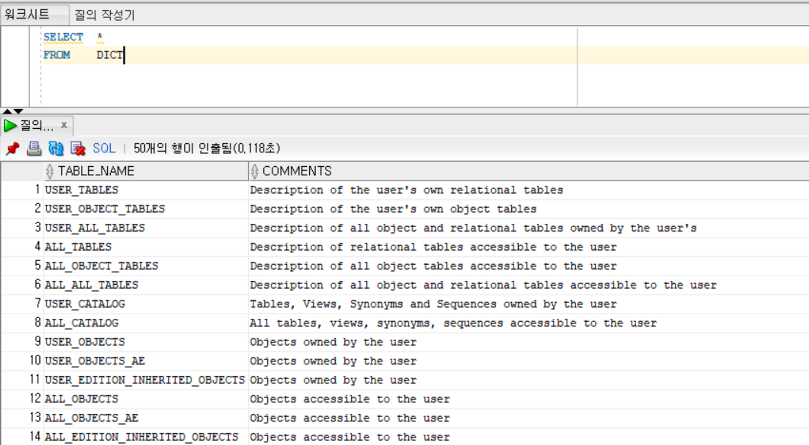

## 1월 4주차 문제 풀이 기록

- 최소 1주일에 1번은 문제 풀이 진행하기
- 문제 풀이 1번에 3문제는 풀기 (단, 최소 1문제는 중급 난이도)
- 성능 향상이 가능해 보이는 쿼리의 경우 나중에 따로 Keep해두기
- 문제 풀었을 때의 기록 외에도 **왜** 그렇게 작성했는지 생각해보기

`문제 플랫폼`     
Do it! Oracle 데이터베이스 입문, 프로그래머스

`문제 풀이에 참여한 날짜`

- [1월 16일](#1월-16일)
- [1월 17일](#1월-17일)
- [1월 18일](#1월-18일)
- [1월 19일](#1월-19일)
- [1월 21일](#1월-21일)

---

### 1월 16일

### SELECT 절에서 * 사용하지 않는 이유

SELECT 절에서 출력할 열을 *로 표시할 경우 어떤 열이 어떤 순서로 출력되는지 명확히 알 수 없을 뿐만 아니라,

특정 열이 새로 생기거나 삭제되거나, 또는 어떤 이유로 수정되었을 경우에 그 변화의 감지 및 변화에 따른 프로그램 수정이 쉽지 않을 수도 있기 때문

---

### 1.

`SQL-99 이전`

```sql
SELECT D.DEPTNO
       , D.DNAME
       , E.EMPNO
       , E.ENAME
       , E.SAL
FROM DEPT D, EMP E
WHERE D.DEPTNO = E.DEPTNO AND E.SAL > 2000
```

`SQL-99 이후`

```sql
SELECT D.DEPTNO
       , D.DNAME
       , E.EMPNO
       , E.ENAME
       , E.SAL
FROM DEPT D JOIN EMP E ON D.DEPTNO = E.DEPTNO
WHERE E.SAL > 2000
```

---

### 2.

`SQL-99 이전`

```sql
SELECT  D.DEPTNO
        , D.DNAME
        , TRUNC(AVG(E.SAL),0) AS AVL_SAL
        , MAX(E.SAL) AS MAX_SAL 
        , MIN(E.SAL) AS MIN_SAL
        , COUNT(*) AS CNT
FROM    EMP E, DEPT D
WHERE   E.DEPTNO = D.DEPTNO
GROUP BY D.DEPTNO, D.DNAME
ORDER BY D.DEPTNO
```

`SQL-99 이후`

```sql
SELECT  D.DEPTNO
        , D.DNAME
        , TRUNC(AVG(E.SAL),0) AS AVL_SAL
        , MAX(E.SAL) AS MAX_SAL 
        , MIN(E.SAL) AS MIN_SAL
        , COUNT(*) AS CNT
FROM    EMP E INNER JOIN DEPT D
ON   E.DEPTNO = D.DEPTNO
GROUP BY D.DEPTNO, D.DNAME
ORDER BY D.DEPTNO
```

### 3.

`SQL-99 이후`

```sql
SELECT  D.DEPTNO
        , D.DNAME
        , E.EMPNO
        , E.ENAME
        , E.JOB
        , E.SAL
FROM EMP E RIGHT OUTER JOIN DEPT D ON E.DEPTNO = D.DEPTNO
ORDER BY D.DEPTNO, D.DNAME
```

- `**RIGHT OUTER JOIN**` 역시 `**INNER JOIN**`처럼 **ON에 조인 조건을 적어둬야 함!**

### 4.

`SQL-99 이후`

```sql
SELECT  D.DEPTNO
        , D.DNAME
        , E.EMPNO
        , E.ENAME
        , E.MGR
        , E.SAL
        , D.DEPTNO AS DEPTNO_1
        , S.LOSAL
        , S.HISAL
        , S.GRADE
        , E.MGR AS MGR_EMPNO
        , E2.ENAME AS MGR_ENAME
        
FROM EMP E  RIGHT OUTER JOIN DEPT D ON D.DEPTNO = E.DEPTNO
            LEFT OUTER JOIN SALGRADE S ON E.SAL BETWEEN S.LOSAL AND S.HISAL
            LEFT OUTER JOIN EMP E2 ON E.MGR = E2.EMPNO
ORDER BY D.DEPTNO, D.DNAME
```

- JOIN을 여러 개 할 때 하나의 테이블을 기준 테이블로 잡고, 조인할 테이블을 넣어주면 됨
- 등가 조인 외에도 비등가 조인이 있음. ON 조건에 등가(=) 할 필요 없이 Between이나 > , < 로 조인 조건을 걸 수 있음.
- 셀프 조인의 경우 같은 Primary Key로 하면 어차피 똑같은 결과가 나오므로, 셀프 조인을 진행할 때는 어떤 열을 조인할 지 생각해두기.

---

### 1월 17일

### 1.

```sql
SELECT  E.JOB
        , E.EMPNO
        , E.ENAME
        , E.SAL
        , D.DEPTNO
        , D.DNAME
FROM EMP E, DEPT D 
WHERE E.DEPTNO = D.DEPTNO
AND
JOB IN (
    SELECT JOB
    FROM EMP
    WHERE ENAME='ALLEN'
)

ORDER BY SAL DESC
```

### 2.

```sql
SELECT  EMPNO
        ,ENAME
        ,DNAME
        ,HIREDATE
        ,LOC
        ,SAL
        ,GRADE
FROM EMP E INNER JOIN DEPT D
           ON E.DEPTNO = D.DEPTNO
           INNER JOIN SALGRADE S
           ON E.SAL BETWEEN S.LOSAL AND S.HISAL 
WHERE SAL > (
    SELECT AVG(SAL)
    FROM EMP
)
ORDER BY SAL DESC, EMPNO ASC
```

### 3.

```sql
SELECT  E.EMPNO   
        , E.ENAME
        , E.JOB
        , D.DEPTNO
        , D.DNAME
        , D.LOC
FROM EMP E  INNER JOIN DEPT D ON E.DEPTNO = D.DEPTNO
WHERE 
        E.DEPTNO = 10 AND
        E.JOB NOT IN (
            SELECT JOB
            FROM EMP
            WHERE DEPTNO = 30
        )
```

### 4.

`다중행 함수 사용하는 방법`

```sql
SELECT  EMPNO
        , ENAME
        , SAL
        , GRADE
FROM EMP E INNER JOIN SALGRADE S ON E.SAL BETWEEN S.LOSAL AND S.HISAL
WHERE SAL > ALL (
    SELECT SAL
    FROM EMP
    WHERE JOB = 'SALESMAN'
)
ORDER BY EMPNO ASC
```

`다중행 함수 사용하지 않는 방법`

```sql
SELECT  EMPNO
        , ENAME
        , SAL
        , GRADE
FROM EMP E INNER JOIN SALGRADE S ON E.SAL BETWEEN S.LOSAL AND S.HISAL
WHERE SAL > (
    SELECT MAX(SAL)
    FROM EMP
    WHERE JOB = 'SALESMAN'
)
ORDER BY EMPNO ASC
```

---

### 1월 18일

### 1

```sql
INSERT INTO CHAP10HW_DEPT (DEPTNO, DNAME, LOC) 
                    VALUES('50', 'ORACLE', 'BUSAN')
INSERT INTO CHAP10HW_DEPT (DEPTNO, DNAME, LOC) 
                    VALUES('60', 'SQL', 'ILSAN')
INSERT INTO CHAP10HW_DEPT (DEPTNO, DNAME, LOC) 
                    VALUES('70', 'SELECT', 'INCHEON')                
INSERT INTO CHAP10HW_DEPT (DEPTNO, DNAME, LOC) 
                    VALUES('80', 'DML', 'BUNDANG')
```

### 2

```sql
INSERT INTO CHAP10HW_EMP (EMPNO, ENAME, JOB, MGR, HIREDATE, SAL, COMM, DEPTNO) 
                    VALUES('7201', 'TEST_USER1', 'MANAGER', '7788', '2016-01-02', '4500', NULL, '50')
                    
INSERT INTO CHAP10HW_EMP (EMPNO, ENAME, JOB, MGR, HIREDATE, SAL, COMM, DEPTNO) 
                    VALUES('7202', 'TEST_USER2', 'CLERK', '7201', '2016-02-21', '1800', NULL, '50')                    

INSERT INTO CHAP10HW_EMP (EMPNO, ENAME, JOB, MGR, HIREDATE, SAL, COMM, DEPTNO) 
                    VALUES('7203', 'TEST_USER3', 'ANALYST', '7201', '2016-04-11', '3400', NULL, '60')
                    
INSERT INTO CHAP10HW_EMP (EMPNO, ENAME, JOB, MGR, HIREDATE, SAL, COMM, DEPTNO) 
                    VALUES('7204', 'TEST_USER4', 'SALESMAN', '7201', '2016-05-31', '2700', '300', '60')

INSERT INTO CHAP10HW_EMP (EMPNO, ENAME, JOB, MGR, HIREDATE, SAL, COMM, DEPTNO) 
                    VALUES('7205', 'TEST_USER5', 'CLERK', '7201', '2016-07-20', '2600', NULL, '70')                    

INSERT INTO CHAP10HW_EMP (EMPNO, ENAME, JOB, MGR, HIREDATE, SAL, COMM, DEPTNO) 
                    VALUES('7206', 'TEST_USER6', 'CLERK', '7201', '2016-09-08', '2600', NULL, '70') 

INSERT INTO CHAP10HW_EMP (EMPNO, ENAME, JOB, MGR, HIREDATE, SAL, COMM, DEPTNO) 
                    VALUES('7207', 'TEST_USER7', 'LECTURER', '7201', '2016-10-28', '2300', NULL, '80') 

INSERT INTO CHAP10HW_EMP (EMPNO, ENAME, JOB, MGR, HIREDATE, SAL, COMM, DEPTNO) 
                    VALUES('7208', 'TEST_USER8', 'STUDENT', '7201', '2016-10-28', '1300', NULL, '80')
```

### 3

```sql
UPDATE  CHAP10HW_EMP 
    SET     DEPTNO='70'
    WHERE   SAL > (
            SELECT AVG(SAL)
            FROM CHAP10HW_EMP
            WHERE DEPTNO='50'
    )
```

### 4

```sql
		 UPDATE     CHAP10HW_EMP
        SET     SAL = SAL * 1.1
                , DEPTNO ='80'
      WHERE     HIREDATE > (
	                SELECT MIN(HIREDATE)
	                FROM CHAP10HW_EMP    
	                WHERE DEPTNO = '60'
)
```

- `**UPDATE**`를 두 개 이상 동시에 적용하기 위해서는 ,(콤마)를 사용하여 조건으로 걸어주면 된다.

### 5
```sql
DELETE  FROM CHAP10HW_EMP 
		    WHERE   EMPNO IN (
        SELECT  E.EMPNO 
          FROM  CHAP10HW_EMP E, SALGRADE S
          WHERE E.SAL BETWEEN S.LOSAL AND S.HISAL
            AND GRADE = '5'   
    )
```

---

### 1월 19일

### 평균 일일 대여 요금 구하기

```sql
SELECT ROUND(AVG(DAILY_FEE),0) AS AVERAGE_FEE
FROM CAR_RENTAL_COMPANY_CAR
WHERE CAR_TYPE = 'SUV'
```

### **카테고리 별 도서 판매량 집계하기**

```sql
SELECT      CATEGORY
            , SUM(SALES) AS TOTAL_SALES
FROM        BOOK B, BOOK_SALES S
WHERE       B.BOOK_ID = S.BOOK_ID 
            AND EXTRACT(YEAR FROM SALES_DATE) = 2022
            AND EXTRACT(MONTH FROM SALES_DATE) = 01
GROUP BY    CATEGORY
ORDER BY    CATEGORY
```

### 최댓값 구하기

```sql
SELECT MAX(DATETIME)
FROM ANIMAL_INS
```

### **이름이 없는 동물의 아이디**

```sql
SELECT      ANIMAL_ID
FROM        ANIMAL_INS
WHERE       NAME IS NULL
ORDER BY    ANIMAL_ID
```

### **이름이 있는 동물의 아이디**

```sql
SELECT      ANIMAL_ID
FROM        ANIMAL_INS
WHERE       NAME IS NOT NULL
ORDER BY    ANIMAL_ID
```

### **NULL 처리하기**


```sql
SELECT      ANIMAL_TYPE
            , CASE WHEN NAME IS NULL THEN 'No name'
                   WHEN NAME IS NOT NULL THEN NAME
                    END AS NAME
            , SEX_UPON_INTAKE        
FROM        ANIMAL_INS
ORDER BY    ANIMAL_ID
```

### 1월 21일

- 오라클 데이터베이스 테이블은 **사용자 테이블**과 **데이터 사전**으로 나뉨
    - 데이터 사전은 데이터베이스를 구성하고 운영하는 데 필요한 모든 정보를 저장하는 특수한 테이블로 데이터베이스가 생성되는 시점에 자동으로 만들어짐

      → 이 데이터에 문제가 발생한다면 오라클 데이터베이스 사용이 불가능해질 수 있음

      따라서, 사용자가 데이터 사전 정보에 직접 접근하거나 작업하는 것을 허용하지 않음

      대신 데이터 사전 뷰를 제공하여 SELECT 문으로 정보 열람을 할 수 있게 해 둠


---

### 사용 가능한 데이터 사전 찾아보기



- USER 접두어로 시작하는 데이터 사전의 경우 현재 오라클에 접속해 있는 사용자가 소유한 객체 정보가 포함되어 있음
- ALL 접두어로 시작하는 데이터 사전의 경우 오라클 데이터베이스에 접속해 있는 사용자가 소유한 객체 및 다른 사용자가 소유한 객체 중 사용이 허락되어 있는 객체 정보를 가지고 있음
- DBA 접두어로 시작하는 데이터 사전의 경우 데이터베이스 관리 권한을 가진 사용자만 조회할 수 있는 테이블로서 SCOTT 계정으로는 조회가 불가능함.

  → 데이터베이스 자체를 관리하는 목적 외에 오라클 데이터베이스를 사용하여 데이터를 보관하고 관리하는 업무를 진행할 때에는 그리 자주 사용하지 않음


---

- 인덱스는 사용자가 **직접 특정 테이블의 열에 지정**할 수도 있지만, **열이 기본 키 또는 고유 키일 때 자동으로 생성**됨

### 인덱스 생성

- 사용자가 직접 인덱스를 만들 때는 `**CREATE**`문을 사용
- CREATE문에서는 인덱스를 생성할 테이블 및 열을 지정하며 열은 하나 또는 여러 개 지정 가능함.

---

### 뷰

- 흔히 가상 테이블로 부르는 뷰는 `**하나 이상의 테이블을 조회하는 SELECT문을 저장**`한 객체

  → SELECT문을 저장하기 때문에 물리적 데이터를 따로 저장하진 않음

- 편리성
    - SELECT문의 복잡도를 완화하기 위해
- 보안성
    - 테이블의 특정 열을 노출하고 싶지 않을 경우

---

### RowNum

- 의사 열이라고 하는 특수열
- 데이터가 저장되는 실제 테이블에 존재하지는 않지만, 특정 목적을 위해 테이블에 저장되어 있는 열처럼 사용 가능한 열을 의미
- ROWNUM 열 데이터 번호는 테이블에 저장된 행이 조회된 순서대로 매겨진 일련 번호
- ROWNUM은 데이터를 하나씩 추가할 때 매겨지는 번호이므로 ORDER BY 절로 정렬해도 유지되는 특성이 있음

---

### 시퀀스

- 오라클 데이터베이스에서 특정 규칙에 맞는 연속 숫자를 생성하는 객체

---

### 동의어

- 테이블, 뷰, 시퀀스 등 객체 이름 대신 사용할 수 있는 다른 이름을 부여하는 객체
- 테이블 이름이 너무 길어 사용이 불편할 때 좀 더 간단하고 짧은 이름을 하나 더 만들어주기 위해 사용
- 동의어를 만들기 위해서는 CREATE문을 사용하여 작성

---

### 문제 풀이

`1-1`

```sql
CREATE  TABLE   EMPIDX
    AS  SELECT  *
        FROM    EMP
```

`1-2`

```sql
CREATE  INDEX   IDX_EMPIDX_EMPNO
        ON      EMPIDX(EMPNO)
```

`1-3`

```sql
SELECT  *
FROM    USER_IND_COLUMNS
```

---

`2`

```sql
CREATE  VIEW    EMPIDX_OVER15K
    AS  (
        SELECT  EMPNO
                , ENAME
                , JOB
                , DEPTNO
                , SAL
                ,CASE    WHEN COMM IS NULL THEN 'X'
                        WHEN COMM IS NOT NULL THEN 'O' 
                END     AS COMM
        FROM    EMPIDX
        WHERE   SAL > 1500     
    )
```

---

`3 - 1`

```sql
CREATE  TABLE   DEPTSEQ
    AS  SELECT  *
        FROM    DEPT
```

`3 - 2`

```sql
CREATE  SEQUENCE DEPTSEQ_
        INCREMENT BY 1
        START WITH 1
        MAXVALUE 99
        MINVALUE 1
        NOCYCLE
        NOCACHE
```

`3 - 3`

```sql
INSERT  INTO DEPTSEQ(DEPTNO, DNAME, LOC)
        VALUES(DEPTSEQ_.NEXTVAL, 'DATABASE', 'SEOUL')

INSERT  INTO DEPTSEQ(DEPTNO, DNAME, LOC)
        VALUES(DEPTSEQ_.NEXTVAL, 'WEB', 'BUSAN')
        
INSERT  INTO DEPTSEQ(DEPTNO, DNAME, LOC)
        VALUES(DEPTSEQ_.NEXTVAL, 'MOBILE', 'ILSAN')
```

---